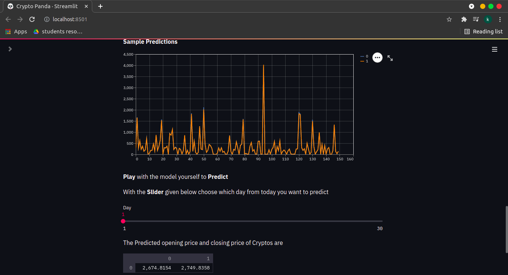

# CryptoPanda
An Interactive Machine learning Webapp that predicts the price of cryptos and let the users play with it

## [Demo app]https://share.streamlit.io/kabilanvennila/crypanda/main

If you want to run this locally 

`cd {repo}`

run the following command to get done with the prerequsites `pip install requirements.txt`

After that navigate into the directory and run `streamlit run streamlit_app.py` 
  
### [Local app ]localhost
### It will be running in your network url as well
